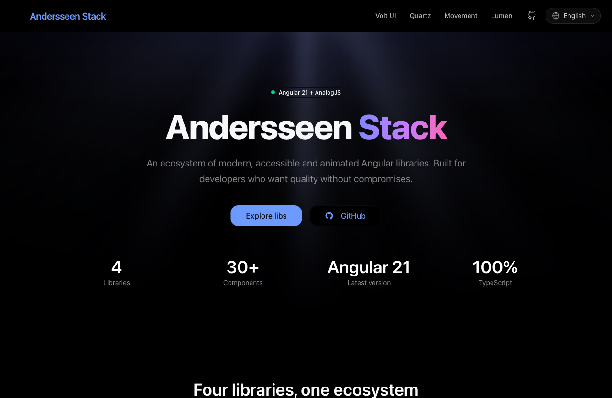

<div align="center">


# Andersseen Stack

### An ecosystem of modern, accessible & animated Angular libraries.

Four focused libraries — **styled components**, **headless primitives**, **declarative animations** and **SVG icons** — built for developers who want quality without compromises.

<br/>

[](https://andersseen-stack.pages.dev)
[](./LICENSE)

<br/>


[](https://github.com/Andersseen/andersseen-stack/actions/workflows/deploy.yml)

</div>

<br/>

<div align="center">
  <a href="https://andersseen-stack.pages.dev">
    
  </a>
</div>

<br/>

## ✨ The Stack

Each library solves one problem well. Use one, or compose all four.

| Library | What it is | Highlights |
| --- | --- | --- |
| ⚡ **[Volt UI](https://andersseen-stack.pages.dev/volt-ui)** | Styled UI components | Theming, variants, accessibility & its own CLI. Built on ng-primitives. |
| 💎 **[Quartz](https://andersseen-stack.pages.dev/quartz)** | Headless primitives | Overlays, dialogs, toasts, tooltips, drag-drop & virtual scroll — logic without styling opinions. |
| 🎬 **[Angular Movement](https://andersseen-stack.pages.dev/angular-movement)** | Declarative animations | WAAPI + springs. Directives for scroll, hover, parallax & presence. |
| ☀️ **[Lumen Icons](https://andersseen-stack.pages.dev/lumen-icons)** | SVG icon set | Icons as tree-shakeable Angular components — accessible, animatable, subpath exports. |

> 🎨 **Companion tool —** need a great color palette for your next project? Try
> **[Palette Crafter](https://github.com/Andersseen/palette-crafter)**, a free standalone
> tool to generate, preview and export accessible color palettes. Not part of the stack,
> just a handy companion.

<br/>

## 🧰 Tech Stack

- **[Angular 21](https://angular.dev/)** — standalone components, signals, hydration
- **[AnalogJS](https://analogjs.org/)** — the fullstack meta-framework for Angular (static SSG here)
- **[Tailwind CSS v4](https://tailwindcss.com/)** — utility-first styling
- **[Vite](https://vitejs.dev/)** — lightning-fast build tool
- **[Vitest](https://vitest.dev/)** + Testing Library — unit tests
- **[Playwright](https://playwright.dev/)** — end-to-end tests
- **[Cloudflare Pages](https://pages.cloudflare.com/)** — hosting + CI/CD

<br/>

## 🚀 Quick Start

**Requirements:** Node.js `>= 20.19.1` · pnpm `>= 10`

```bash
# 1. Clone the repo
git clone https://github.com/Andersseen/andersseen-stack.git
cd andersseen-stack

# 2. Set up sibling libraries (quartz, angular-movement, lumen-icons)
#    They are consumed as file:../ dependencies, so they must be
#    cloned & built next to this repo before installing.
bash scripts/setup-sibling-repos.sh

# 3. Install & run
pnpm install
pnpm run dev
```

The app runs at **http://localhost:5173/**.

<br/>

## 📦 Scripts

| Command | Description |
| --- | --- |
| `pnpm run dev` | Start the dev server |
| `pnpm run build` | Production build → `dist/client` (static SSG) |
| `pnpm run check` | Typecheck + lint |
| `pnpm run test` / `test:run` | Unit tests (watch / CI) |
| `pnpm run e2e` | End-to-end tests (Playwright) |
| `pnpm run format` | Format with Prettier |
| `pnpm run deploy` | Manual production deploy to Cloudflare Pages |

<br/>

## 🧪 Testing

```bash
pnpm run test:run       # Unit (Vitest + Testing Library)
pnpm run test:coverage  # With coverage
pnpm run e2e            # E2E (Playwright, headless)
pnpm run e2e:ui         # E2E interactive UI
```

<br/>

## ☁️ Deployment

A single pipeline, one source of truth. On every push and PR, GitHub Actions
([`.github/workflows/deploy.yml`](.github/workflows/deploy.yml)) runs the quality
gates, **builds the app exactly once**, and ships that same artifact to
**Cloudflare Pages** — no second build at deploy time.

- **`main`** → production at [andersseen-stack.pages.dev](https://andersseen-stack.pages.dev)
- **Pull requests** → an isolated preview URL, posted as a comment on the PR

Manual deploy (from a local machine with `CLOUDFLARE_API_TOKEN` set):

```bash
pnpm run deploy
```

<br/>

## 🤝 Contributing

Issues and PRs are welcome. Please run `pnpm run check` and `pnpm run test:run`
before opening a pull request — every PR gets its own preview deploy to review.

<br/>

## 📄 License

[MIT](./LICENSE) © Andersseen

<div align="center">
  <br/>
  <sub>Built with Angular + AnalogJS · Deployed on Cloudflare Pages</sub>
</div>
